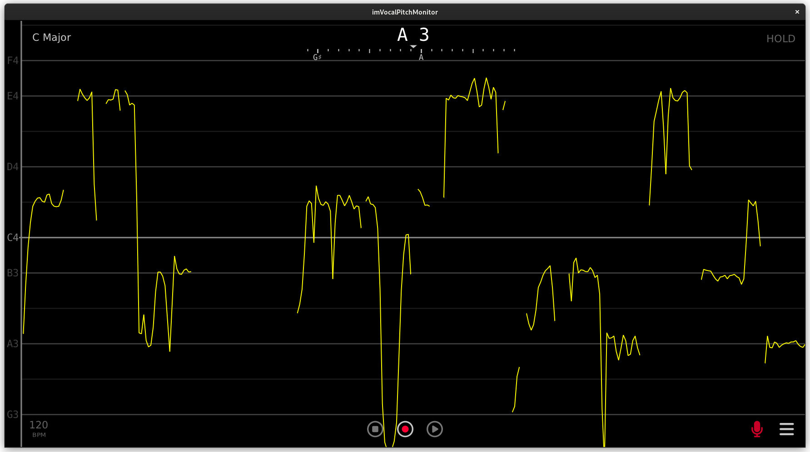

# [VocalPitchMonitor](https://play.google.com/store/apps/details?id=com.tadaoyamaoka.vocalpitchmonitor) port to PC
It is a **reverse engineered** port of the original APK. All the heavy lifting code - audio analyzing and data plotting, belongs to the original author - **Tadao Yamaoka**.
Without his hard work this project wouldn't be possible.

Other software used to create this project:
 * [ImGui](https://github.com/ocornut/imgui) © Omar Cornut
 * [miniaudio](https://miniaud.io) © David Reid
 * [FFT4g](https://github.com/YSRKEN/Ooura-FFT-Library-by-Other-Language), [original author's page](http://www.kurims.kyoto-u.ac.jp/~ooura/fft.html) © YSR, © Takuya OOURA
 * [opusfile, opus, libogg](https://xiph.org) © Xiph.Org Foundation
 * [simpleini](https://github.com/brofield/simpleini) © Brodie Thiesfield
 * [portable-file-dialogs](https://github.com/samhocevar/portable-file-dialogs) © Sam Hocevar
 * [Program Options Parser Library](https://github.com/badaix/popl) © Johannes Pohl
 * [DejaVu fonts](https://dejavu-fonts.github.io) © DejaVu fonts team
 * [Font Awesome](https://fontawesome.com) © Fonticons, Inc.



Recording formats supported:  
WAV  
Playback formats supported:  
WAV MP3 OGG FLAC OPUS  
Default recording path is home directory, you could change it in the settings.  

The program saves it's configuration to %APPDATA%\imvpmrc on Windows and ~/.config/imvpmrc on Linux.  
You could move this file to the program directory and it will operate in 'portable' mode.

Keyboard controls:
|         Key|Function             |
|-----------:|:--------------------|
|      Spcace|Pause / HOLD toggle  |
|  Left arrow|Rewind               |
| Right arrow|Fast forward         |
|           S|Stop                 |
|           R|Record               |
|           P|Play                 |
|           A|Autoscroll toggle    |
|           F|Fullscreen toggle    |
|           M|Mute toggle          |
|           T|Always on top toggle |

Mosue controls:
|           Control|Function             |
|-----------------:|:--------------------|
| Left button click|Pause / HOLD toggle  |
|  Left button drag|Pan                  |
|             Wheel|Vertical scroll      |
|      Ctrl + Wheel|Vertical zoom        |
|     Shift + Wheel|Horizontal zoom      |

Command line:  
```
imvpm [options] [file]
options:
  -i, --capture <device>  set preferred capture device
                          partial, case insensitive (but only for Latin symbols)
                          match is supported
  -o, --playback <device> set preferred playback device
  -r, --record            start recording
  -v, --verbose           enable debug log
```

## Building from source
Build tools required:  
 * CMake
 * git
 * ninja
 * C++11 compiler
 * patch (on windows you'll get it with git, just
   ```
   set PATH=%PATH%;%PROGRAMFILES%\Git\usr\bin
   ```
   prior to configure)
 * Windows build:
   * Windows SDK
   * MSVC libs  
     if you use MinGW, it bundles both
 * Linux build (development versions):
   * SDL2
   * vulkan
   * kdialog / zenity
   * opusfile

to configure run:
```
cmake . -B build -GNinja -DCMAKE_BUILD_TYPE=Release
```
CMake will download required dependencies from the GitHub and produce the build configuration.  
You could also specify **-DVENDORED_BUILD=yes** to use local dependency sources
that you provide in the **external** directory.  
list of required dependencies:
|dir name|URL|
|--------------:|:----------------------------------|
|          imgui|https://github.com/ocornut/imgui
|      miniaudio|https://github.com/mackron/miniaudio
|          fft4g|https://github.com/YSRKEN/Ooura-FFT-Library-by-Other-Language
|      simpleini|https://github.com/brofield/simpleini
|            pfd|https://github.com/samhocevar/portable-file-dialogs
|           popl|https://github.com/badaix/popl
|         libogg|https://github.com/xiph/ogg
|           opus|https://github.com/xiph/opus
|       opusfile|https://github.com/xiph/opusfile

if configure succedes, to start the build run:
```
cmake --build build
```
